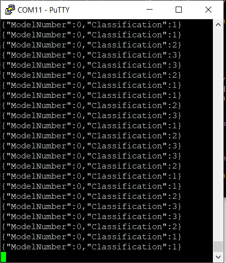

# Application Template using AVR128DA48 Curiosity Nano

The demo project runs on the [AVR Curiosity Nano](https://www.microchip.com/developmenttools/ProductDetails/EV45Y33A) with the Bosch BMI160 ([Mikroe IMU2 click board](https://www.mikroe.com/6dof-imu-2-click)) or TDK ICM42688 ([Mikroe IMU14 click board](https://www.mikroe.com/6dof-imu-14-click)) sensors.

## Related Documentation

- [AVR® DA Family Product Page](https://www.microchip.com/en-us/products/microcontrollers-and-microprocessors/8-bit-mcus/avr-mcus/avr-da)

## Software Used
* MPLAB® X IDE (>=5.45 Recommended) [(microchip.com/mplab/mplab-x-ide)](http://www.microchip.com/mplab/mplab-x-ide)
* MPLAB® XC8 (>=2.32 Recommended) [(microchip.com/mplab/compilers)](http://www.microchip.com/mplab/compilers)
* MPLAB® Code Configurator (MCC) (>=5.1.0 Recommended) [(microchip.com/mplab/mplab-code-configurator)](https://www.microchip.com/mplab/mplab-code-configurator)
* MPLAB® Code Configurator (MCC) Device Libraries AVR MCUs [(microchip.com/mplab/mplab-code-configurator)](https://www.microchip.com/mplab/mplab-code-configurator)
* Microchip AVR-Dx Series Device Support (1.9.119 Recommended) [(packs.download.microchip.com)](https://packs.download.microchip.com)

## Hardware Documentation
* AVR128DA48 Curiosity Nano Evaluation Kit [(DM164151)](https://www.microchip.com/Developmenttools/ProductDetails/DM164151)
* Curiosity Nano Base for Click boards™ [(AC164162)](https://www.microchip.com/developmenttools/ProductDetails/AC164162)
* IMU 2 click board [(mikroe.com/6dof-imu-2-click)](https://www.mikroe.com/6dof-imu-2-click)
* IMU 14 click board [(mikroe.com/6dof-imu-14-click)](https://www.mikroe.com/6dof-imu-14-click)

## Data Collection Firmware
To build data logging firmware for different sensor configurations, visit the [ml-avrda-cnano-imu-data-logger](https://github.com/MicrochipTech/ml-avrda-cnano-imu-data-logger) repository.

## Sensor Configuration
Although this project is currently configured to use test the data sensor configuration is summarized in the table below. These settings can be changed by modifying `app_config.h`.

| IMU Sensor | Axes | Sampling Rate | Accelerometer Range | Gyrometer Range |
| --- | --- | --- | --- | --- |
| Bosch BMI160 | Ax, Ay, Az, Gx, Gy, Gz | 100Hz | 2G | 125DPS |

## Firwmare Operation
Using the test data provided in the knowledge pack, the classifications will count 1,2,3,3,2,1.

The firmware prints the classification output for each inference over the UART port. To read the UART port output, use a terminal emulator of your choice (e.g., PuTTY) with the following settings:

- Baudrate 115200
- Data bits 8
- Stop bits 1
- Parity None

The terminal output should look similar to the figure shown below.

|  |
| :--: |
| UART Terminal Output |

## Firmware Benchmark
Measured with the BMI160 sensor configuration, ``-O2`` level compiler optimizations, and 4MHz clock
- 30kB Flash
- 2.6kB RAM
- 24ms Inference time (average)

## Summary
The example firmware in this repository will print test classifications.  
